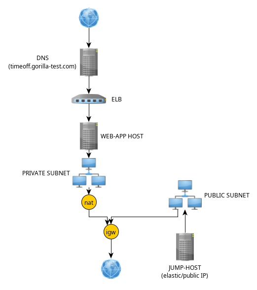
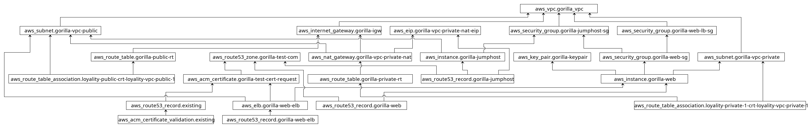

 
## _Time-off Gorilla application test cloud deployment_

AWS was chosen as the cloud provider to host all of the app's support infrastructure. In order to not make mistakes and build the infrastructure in a repeatable way, and to make the creation and destruction process of such infrastructure easy and ordered, Terraform was chosen as an IaC tool to achieve this.

Once the infrastructure was created, we needed to provision all the servers with the necessary software and dependencies. Ansible was selected as our provisioning tool to achieve this task.

For this deployment, we have two machines:

1. gorilla-jumphost, accessible directly from the internet through a public IP (the public IP from the accesor must be registered in a security group attached to the instance).

2. gorilla-web, which supports all the source code, services, and binaries from the application. This instance is not reachable from the internet directly but only from gorilla-jumphost via port 22 and app's end users clients through a load balancer. Such load balancer is attached to a ssl certificate in order to bring the "https" schema to the url wich they type on her browsers.

Let's talk a little bit more about gorilla-web instance. This instance basically has three types of assets:
1. The source code of the application that is supported by a git system and is staged on the master branch.
There's not much to say except that a shell script is executed each time an income push event arrives from a web_hook installed on the git origin upstream (GitHub) where the source repository resides. Such a shell script makes a "git pull" to update the code and reset a service that re-installs the app and makes it available to the end users.

2. The app's binaries generated following the instructions from the app's Readme file and re-generated each time a push event is detected from our local web-hook daemon.

3. System and application services, as well as deamons.
Services like Nginx, which is our web server, and supervisord, which manages and monitors our daemon processes and daemons, which are 3 of them:

-  gorilla-timeoff-app: This daemon manages the execution of the shell script supervisord_start_app.sh, which installs and starts the application from its source code.

- gorilla-timeoff-web_hook: This daemon manages the execution of the web_hook listener service, a web service written by myself in the Rust programming language using the Actix-web framework. This web service listens on port 8080 and is in charge of creating a new file with a random uuid4 name each time a web hook post request arrives from GitHub in order to get processed by our third daemon below.

- web_hook_push_request_processor: This daemon manages the execution of the shell script web_hook_push_request_processor.sh, which uses a loop process to search for web_hooks, detecting any txt files created by the web_hook local service described above.

In order to list all the deamons described above, you're free to issue a systemctl status command to achieve that.

About the infrastructure,  below a diagram that briefly explains the architecture.

The application is currently available at: https://timeoff.gorilla-test.com/

And the repository where original web application where forked at: https://github.com/mendinuetaj/gorilla-timeoff
